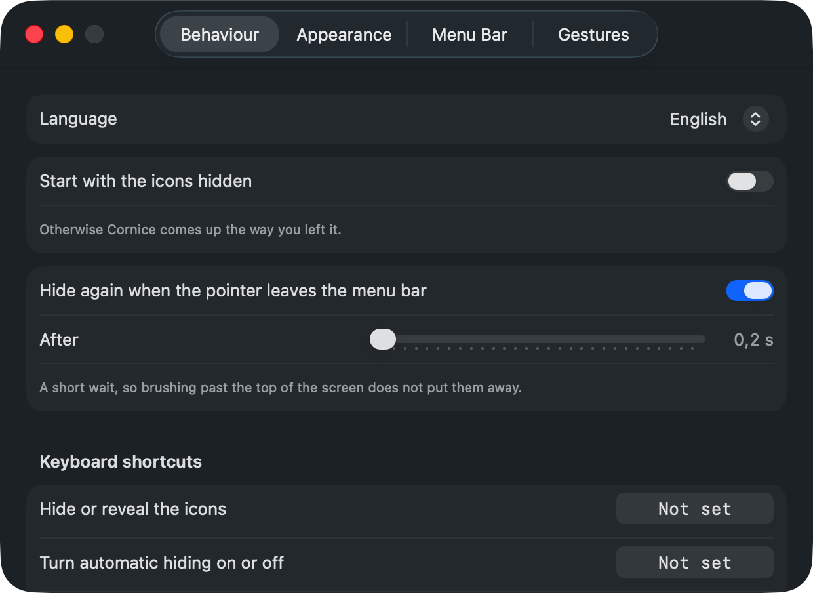
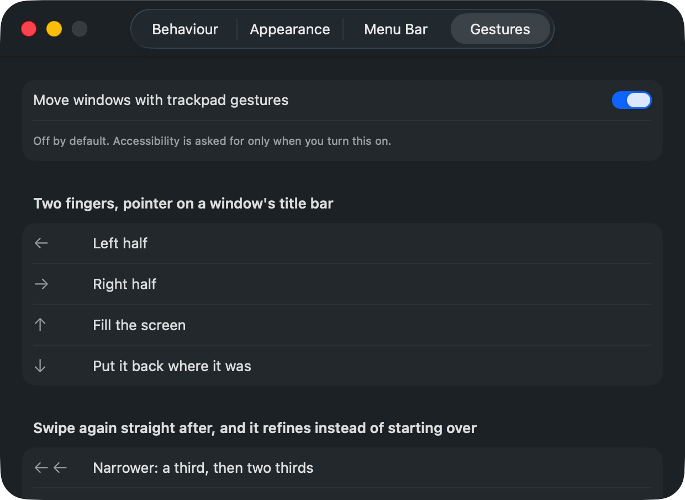
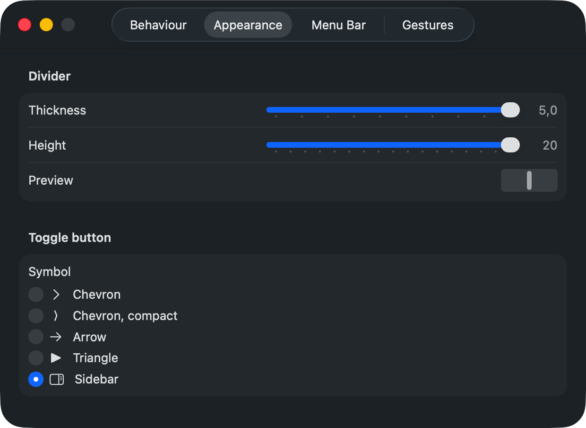

# Cornice

A free, open-source menu bar manager for macOS.

A *cornice* is the horizontal moulding that runs along the top edge of a building.
The menu bar is the cornice of your screen.

## What it does

You place a divider in the menu bar. Everything to its left hides when you click the
chevron, and comes back when you click again.

```
[ hidden ]  │  [ visible ]  ❯
```

- Hide and reveal with one click
- You choose where the line falls: ⌘-drag the divider, and Cornice never moves it
- Optional auto-hide once the pointer leaves the menu bar
- A keyboard shortcut of your choosing, for hiding and for auto-hide
- Open at login
- Adjustable divider thickness and height, five chevron styles
- 16 interface languages, switched without restarting



**No permissions are needed for any of that.** Hiding and revealing are done with Cornice's
own status item, which any application may resize freely, and the keyboard shortcuts use an
API that asks for nothing. Cornice does not request Accessibility at startup, or at all,
unless you turn on something that cannot work without it.

## Window gestures

Off by default. Turn them on in Settings, and only then does Cornice ask for Accessibility.

Put the pointer over a window's title bar and swipe two fingers on the trackpad. Title bars
are the whole trigger surface, which is what keeps this from colliding with anything else:
nothing scrolls a title bar.

| Gesture | Result |
|---|---|
| Swipe left or right | Left or right half |
| Swipe up | Fill the screen |
| Swipe down | Put the window back where it was |
| Swipe again, straight after | Narrows to a third, then two thirds |
| Swipe up or down after that | The quarter above or below |
| Pinch in | Send the window to the Dock |



Four movements, twelve positions. A second swipe within a second and a half refines the
first rather than replacing it; pause, and the next swipe starts over.

Cornice only ever watches these events. It cannot swallow one, so a gesture read wrong still
reaches the application under your pointer exactly as it would have.

## Making it yours

The divider is drawn, not an image, so its thickness and height are yours to set, and the
preview is at real size because two points is a visible difference in a menu bar.



## Installing

Open `Cornice.dmg` from the [latest release](https://github.com/SnowDrit/Cornice/releases)
and drag the app onto the Applications shortcut.

macOS will refuse to open it the first time. The builds are signed for development and not
notarised, which needs a paid Apple Developer account. Right-click the app in Applications,
choose Open, then Open again in the warning. Once is enough.

The same limitation has a second effect, and only if you use the gestures: because the
builds are ad-hoc signed, macOS ties the Accessibility grant to that exact build, so
updating means granting it again. The menu bar half is unaffected, since it never needed the
permission in the first place.

Requires macOS 26 (Tahoe) or later on Apple Silicon.

## What it deliberately does not do

Cornice does not move other applications' icons for you, so there is no checklist of things
to hide. The only way to do that is a synthesised ⌘-drag, which is unreliable on macOS 26
and which macOS 27 hands to Mission Control. Placing the divider is a one-off you do by
hand.

No second menu bar, no screen capture, no widgets, no triggers, no profiles, no menu bar
styling, no per-icon hotkeys. Those are what make the other tools large, and they are the
first things to break.

The gesture module stops at moving windows around one screen. No thirty-gesture catalogue,
no per-application rules, no gesture for closing a window: a trackpad is not precise enough
to be trusted with something that can take unsaved work with it.

## Why

Menu bar managers on macOS are in a bad way:

- **Ice** (29k stars): last stable release October 2024, repository untouched since
  September 2025, 400+ open issues. Does not support macOS 26.
- **SaneBar**: [sunset by its author on 1 July 2026](https://github.com/sane-apps/SaneBar/releases/tag/sunset)
  and relicensed to MIT, because macOS 27 breaks it.
- **Bartender**: commercial, and its macOS 27 build is an early technical preview with most
  features not yet restored.

Apple provides no public API for managing other applications' menu bar items. Every tool in
this category is built on accessibility APIs and undocumented behaviour, and every macOS
release moves the ground.

Cornice's answer is to need almost none of it. The thing you do every day, hide and reveal,
touches nothing Apple has signalled it will change. If a future macOS withdraws what the
settings window uses, you lose a list of names and keep the app.

## Contributing

Translations are machine-made and want a native reader's eye. Each one is a plain
dictionary in `Cornice/Localization.swift`, keyed by the English text, so fixing a string is
a single line.

## Building

```bash
git clone https://github.com/SnowDrit/Cornice.git
cd Cornice
open Cornice.xcodeproj
```

Set your own signing team in the target settings. The app must not be sandboxed: Xcode's
template enables the sandbox, and a sandboxed build sees only its own status item while
reporting no error at all.

## License

GPL-3.0. See [LICENSE](LICENSE).

Cornice studies [Ice](https://github.com/jordanbaird/Ice) (GPL-3.0) as a reference for menu
bar item manipulation. GPL-3.0 keeps that relationship unambiguous.
