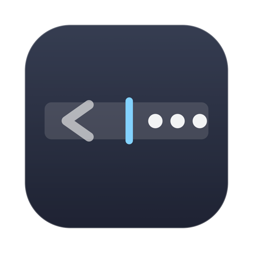
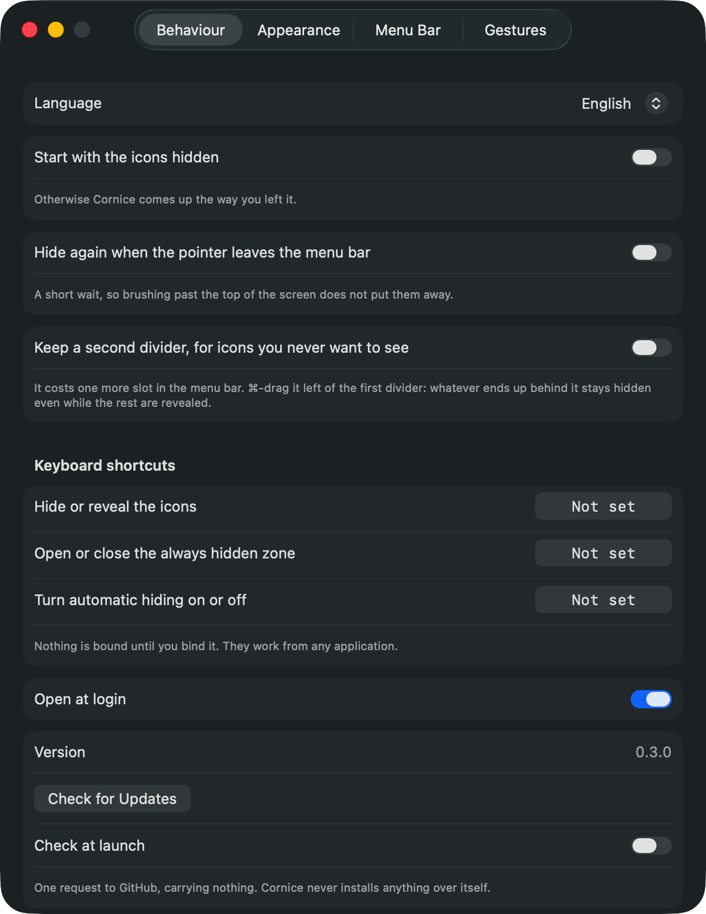
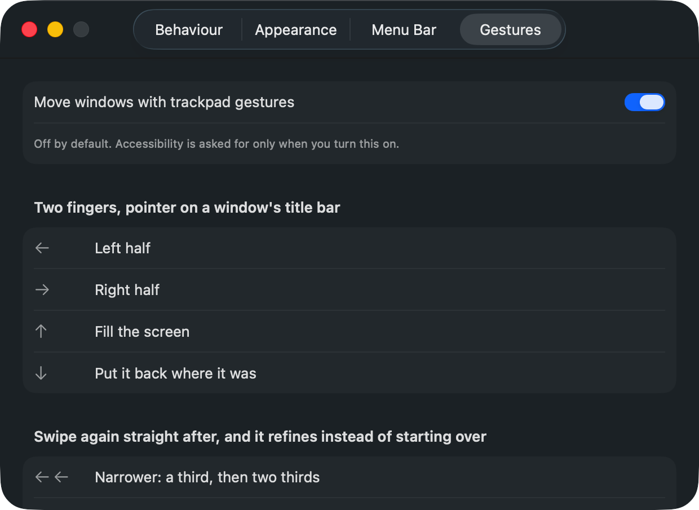
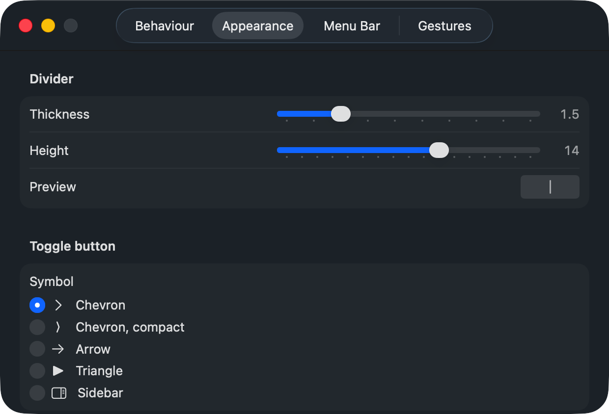

<div align="center">
    
    <h1>Cornice</h1>
    <p><b>A free, open-source menu bar manager for macOS.</b></p>
</div>

<div align="center">

[](https://github.com/SnowDrit/Cornice/releases/latest)


[](LICENSE)

</div>

A *cornice* is the horizontal moulding that runs along the top edge of a building.
The menu bar is the cornice of your screen.

## What it does

You place a divider in the menu bar. Click the chevron to hide the group to its left,
and click again to reveal it. macOS 27 has some [compatibility limits](#macos-27).

```
[ hidden ]  │  [ visible ]  ❯
```

There is a second divider too, if you want a zone that stays hidden even when the rest is
revealed. It is off until you ask for it.

- Hide and reveal with one click
- You choose where the line falls: ⌘-drag the divider, and Cornice never moves it
- An optional [always hidden zone](#the-always-hidden-zone) behind a second divider
- Optional auto-hide once the pointer leaves the menu bar
- Keyboard shortcuts of your choosing, for hiding, for the always hidden zone, and for
  auto-hide
- Open at login
- Adjustable divider thickness and height, five chevron styles
- [Sixteen interface languages](#languages), switched without restarting



**On macOS 26, hiding and revealing need no permissions.** On macOS 27, enable
Accessibility for Cornice in System Settings so it can read which icons belong to each
group. Cornice automatically detects missing access. Clicking the chevron, ⌥-clicking it,
or using a shortcut for either group then shows an explanation with an **Open Accessibility
settings** button. Cornice explains why it cannot hide icons; revealing remains available.
Your other settings and divider positions are preserved. After granting access, repeat the
click or shortcut to hide icons. Startup and background checks never open this explanation
or a permission prompt. Keyboard shortcuts need no additional permission.

## macOS 27

Reveal the groups before rearranging their icons, then ⌘-drag the dividers into place.
Command alone does not open a group. After you release the mouse button, Cornice reads
the new positions and restores the requested visibility. Hidden dividers collapse to
avoid leaving empty spaces. Your divider positions and toggle position are preserved.

If one application has icons in several groups, its icons stay visible whenever any
of them belongs to a visible group. The system service also hides certain Apple icons,
including AirDrop and fast user switching, even when they are to the right of the
main divider. To show those icons, reveal both zones, or open Cornice again from Finder.

Icons temporarily reappear while the pointer is over the clock so Notification Center
can open. If hiding stops working or the toggle disappears, opening Cornice again from
Finder reveals both zones without changing your divider positions.

Some bugs may remain. Please [report unexpected behavior in Issues](https://github.com/SnowDrit/Cornice/issues),
including your macOS version and the steps to reproduce it.

## The always hidden zone

Off by default. Switch it on and you get a second divider, drawn as a double line.

```
[ always hidden ]  ‖  [ hidden ]  │  [ visible ]  ❯
```

⌘-drag it to the left of the first divider. Whatever ends up behind it stays hidden even
while the chevron reveals the rest, which is where things go that you want installed and
never want to look at. ⌥-click the chevron to open the zone, or bind a shortcut to it.

The leftmost divider is always the always hidden one. Drag one past the other and their
jobs swap, so there is nothing to configure and nothing that can end up disagreeing with
what you see.

It costs one more slot in the menu bar, which is why it is off until you ask. It uses the
same hiding mechanism and permissions as the main group, including the macOS 27 limits
above.

## Window gestures

Off by default. Turn them on in Settings to enable them. Gestures need Accessibility;
Cornice asks for it when you enable gestures if the permission is not already granted.

Put the pointer over a window's title bar and swipe two fingers on the trackpad. Title bars
are the whole trigger surface, which is what keeps this from colliding with anything else:
nothing scrolls a title bar.

| Gesture | Result |
|---|---|
| Swipe left or right | Left or right half |
| Swipe up | Fill the screen |
| Swipe down | Put the window back where it was |
| Swipe again, straight after | Narrows to a third, then two thirds |
| Swipe up or down after that | The quarter above or below |
| Pinch in | Send the window to the Dock |



Four movements, twenty-one positions. A second swipe within a second and a half refines the
first rather than replacing it; pause, and the next swipe starts over.

Cornice only ever watches these events. It cannot swallow one, so a gesture read wrong still
reaches the application under your pointer exactly as it would have.

## Making it yours

The divider is drawn, not an image, so its thickness and height are yours to set, and the
preview is at real size because two points is a visible difference in a menu bar. With the
always hidden zone switched on the preview shows both marks, since the double line follows
the same two sliders.



## Installing

Open `Cornice.dmg` from the [latest release](https://github.com/SnowDrit/Cornice/releases)
and drag the app onto the Applications shortcut.

Release builds are ad-hoc signed and not notarised. If macOS blocks the first launch,
follow [Apple's instructions for opening an app you trust](https://support.apple.com/en-us/102445):
after trying to open Cornice, go to System Settings > Privacy & Security and choose
Open Anyway for Cornice.

After an ad-hoc signed update, the previous Accessibility grant may no longer apply.
This affects window gestures on either system and menu bar hiding on macOS 27.
Open System Settings > Privacy & Security > Accessibility and enable Cornice.
If Cornice is already enabled but access still does not work, select its entry and remove
it with the minus button. Use the plus button to add the current `Cornice.app` from
Applications, then enable it. Remove only the entry in the Accessibility list, not the
app from Applications. Your Cornice settings and divider positions stay intact.

Requires macOS 26 (Tahoe) or later on Apple Silicon.

### Updates

Settings has a Check for Updates button, and a switch for asking once at launch that is off
until you turn it on. Either way it is one anonymous request to GitHub's public list of
releases, carrying nothing about you, and Cornice makes no network request at any other
time. If something newer exists it says so in Settings and in the right-click menu, and the
link opens the release page.

It stops there on purpose. See below.

## What it deliberately does not do

Cornice does not move other applications' icons for you, so there is no checklist of things
to hide. The only way to do that is a synthesised ⌘-drag, which is unreliable on macOS 26
and which macOS 27 hands to Mission Control. Placing the divider is a one-off you do by
hand.

No second menu bar, no screen capture, no widgets, no triggers, no profiles, no menu bar
styling, no per-icon hotkeys. Those are what make the other tools large, and they are the
first things to break.

The gesture module stops at moving windows around one screen. No thirty-gesture catalogue,
no per-application rules, no gesture for closing a window: a trackpad is not precise enough
to be trusted with something that can take unsaved work with it.

Cornice does not install updates over itself. Replacing a running application with something
just downloaded means first proving the download is genuine, and these builds are ad-hoc
signed on the runner, so there is no stable identity to check it against. Cornice may hold
Accessibility for menu bar hiding or gestures, and an event tap for gestures, so replacing
it must preserve trust in the application. It finds the release and hands you the link.

## Why

Cornice keeps the configuration positional: you arrange icons and dividers yourself.
macOS 26 uses the system's overflow layout without permissions. macOS 27 needs
Accessibility and a private system service, with the limitations described above.
Neither path moves your dividers or rearranges other applications' icons.

## Languages

Cornice speaks sixteen, switched from the settings window without restarting.

<table frame="void" rules="none">
    <tr>
        <th align="left">Language</th>
        <th align="center">Flag</th>
        <th align="left">Code</th>
        <th width="30"></th>
        <th align="left">Language</th>
        <th align="center">Flag</th>
        <th align="left">Code</th>
    </tr>
    <tr>
        <td><b>English</b></td>
        <td align="center">🇬🇧</td>
        <td><code>en</code></td>
        <td width="30"></td>
        <td><b>Русский</b></td>
        <td align="center">🇷🇺</td>
        <td><code>ru</code></td>
    </tr>
    <tr>
        <td><b>Українська</b></td>
        <td align="center">🇺🇦</td>
        <td><code>uk</code></td>
        <td width="30"></td>
        <td><b>Deutsch</b></td>
        <td align="center">🇩🇪</td>
        <td><code>de</code></td>
    </tr>
    <tr>
        <td><b>Français</b></td>
        <td align="center">🇫🇷</td>
        <td><code>fr</code></td>
        <td width="30"></td>
        <td><b>Español</b></td>
        <td align="center">🇪🇸</td>
        <td><code>es</code></td>
    </tr>
    <tr>
        <td><b>Português</b></td>
        <td align="center">🇵🇹</td>
        <td><code>pt</code></td>
        <td width="30"></td>
        <td><b>Italiano</b></td>
        <td align="center">🇮🇹</td>
        <td><code>it</code></td>
    </tr>
    <tr>
        <td><b>Nederlands</b></td>
        <td align="center">🇳🇱</td>
        <td><code>nl</code></td>
        <td width="30"></td>
        <td><b>Polski</b></td>
        <td align="center">🇵🇱</td>
        <td><code>pl</code></td>
    </tr>
    <tr>
        <td><b>Čeština</b></td>
        <td align="center">🇨🇿</td>
        <td><code>cs</code></td>
        <td width="30"></td>
        <td><b>Svenska</b></td>
        <td align="center">🇸🇪</td>
        <td><code>sv</code></td>
    </tr>
    <tr>
        <td><b>Türkçe</b></td>
        <td align="center">🇹🇷</td>
        <td><code>tr</code></td>
        <td width="30"></td>
        <td><b>日本語</b></td>
        <td align="center">🇯🇵</td>
        <td><code>ja</code></td>
    </tr>
    <tr>
        <td><b>한국어</b></td>
        <td align="center">🇰🇷</td>
        <td><code>ko</code></td>
        <td width="30"></td>
        <td><b>简体中文</b></td>
        <td align="center">🇨🇳</td>
        <td><code>zh</code></td>
    </tr>
</table>

English is the source: every string in the code *is* its English text, so nothing can go
missing from it. The other fifteen are machine-made and want a native reader's eye. They are
plain dictionaries in `Cornice/Localization.swift`, keyed by that English text, so correcting
a translation is a one-line change and needs no tooling, no string catalogue and no account
anywhere.

## Contributing

Fixing a translation is the most useful thing you can do here, and the cheapest: find the
English key in `Cornice/Localization.swift`, change the string beside it in your language,
open a pull request.

## Building

```bash
git clone https://github.com/SnowDrit/Cornice.git
cd Cornice
open Cornice.xcodeproj
```

Set your own signing team in the target settings. The app must not be sandboxed: Xcode's
template enables the sandbox, and a sandboxed build sees only its own status item while
reporting no error at all.

## License

GPL-3.0. See [LICENSE](LICENSE).

Cornice studies [Ice](https://github.com/jordanbaird/Ice) (GPL-3.0) as a reference for menu
bar item manipulation. GPL-3.0 keeps that relationship unambiguous.
